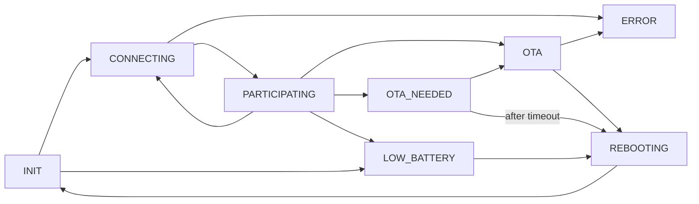

# Open Trivia Remote System

This is an open-source trivia/learning system.
It consists of two parts: the presenter and the remote.
The presenter is a laptop and the remotes are based around the ESP32-S3 SoC.

## Motivation

I was teaching a group high school age kids (mostly freshmen and sophomores) and existing trivia solutions (Quizlet, ) that had worked for seniors were no longer viable.
Mostly because some students had phones and some did not. 
Even some who had phones had a highly locked down down phone that couldn't access websites.

## Goals

- A sturdy and simple remote that students can intuitively use
- Run locally in environments with flakey or no internet connection
- An easy to use presenter interface that integrates with any other audiovisual elements of teaching
- Remotes belong to the teacher not the student
- Extensible interface for adding new ways of using remote (not just trivia)
- Support dozens of concurrent remotes (hundreds or thousands of remotes *should be* possible, just not a goal of this project)

Future goals:

- Send state machine/bytecode to remotes so they do not need to be flashed to run new apps
- Offer pre-built hardware on Tindie for others to use this project at a reasonable cost

## Non-goals

- No integration with gradebooks, this system is focused on trivia as a learning mechanism, not a measuring system
- Monetization of system itself, only the hardware will be sold

These are explicitly things this project is avoiding.
As noted in the extension policy, feel free to fork this repo to create those features.
Pull requests will be ignored and closed if they attempt to add a non-goal.

## Extension Policy

If you like this system, feel free to fork or offer up a pull request.
All files in this repo are provided under a {LICENSE} license.

## Repo Organization

There are a few folders:

- hardware - the PCB files (KiCad) for the trivia remote, BOM, build guide, as well as 3d case files
- server - the code for the presenter
- firmware - code for the remote itself
- assets - picture and diagrams

## Tech Stack

### Remote

The remote is based around the LilyGo-S3 with a 2" screen.
It includes four buttons that can be used for any purpose.
It may include some additional sensors or outputs such as:

- Gyro
- Simple shake sensor
- Vibration motor (for notifying of state changes)
- LEDs

Currently, there aren't any of these sensors/output devices planned but the code/pcb should be flexible and allow future enhancement.

Additionally, there will be two simulators of the remote that connects to the presenter over a websocket.
It can be used for unit testing as well as local developer testing without having to use the whole.
One is inside the presenter system itself and the other is the actual firmware recompiled to connect over the websocket.

The remotes are designed with a larger state machine controlling the connection to the mesh.



It connects to the mesh network (more on that later in communications).

The server can then send a bloom filter needed to participate in this game.
The bloom filter is created by creating hashes for the app name + version number that will be used in this presentation.
The remote calculates its own bloom filter and makes sure that all the values needed are present in its own internal bloom filter.
If a needed app is missing, it then goes into the `OTA_NEEDED` state where UI is shown to let the user know their remote is out of date.

Low Battery is just when a remote needs to be charged.

While a remote is participating, it answers basic system updates from the server and other remotes.
It will send heartbeat pings which include current state and battery level.
The above version mechanism is part of that system level commands.
While participating, the remote has a secondary state machine system that run many state machines.
The presenter is authoritative and can send a message putting a remote into a given app state.
These are known as "apps" and will be documented separately.
These apps can run on all remotes simultaneously or on a single remote.

Some example apps are:

#### Dark

Dark is just a dark screen and no button presses are transmitted.
It is focused on low power.

#### Text

Similar to dark but shows a message on the screen that is the same for all remotes

#### Name Select

Each remote is given a choice of emoji and the user can pick their "name" that will be shown in the presenter.
There will be 80 emojis to pick from which means 20 players get 4 choices.
If there are 26 players they get 3 choices.
With 40 players, they only get 2 choices.

In the event that there are more players than emojis, players will have to pick two emojis (which should support at least 1600 players).

#### Trivia

The most common mode, where it shows A, B, C, D and transmits a single button press back to the presenter.
Once a button has been pressed it goes into a confirmed mode that accepts no further input.

### Presenter

The presenter runs on a laptop (or perhaps iPad) and shows visuals.
It is authoritative and determines state.
Remotes can have some internal logic but most processing happens on the server.

It is a nodeJS server serving a vueJS/vite webapp.
Communication is over a websocket.

The driving metadata are called presentations, which have strong typing via zod.
An example presentation might be:

```ts
const presentation = [
{
    // Intro - dark state
    type: 'intro',
    text: "Welcome to class!"
},
{
    // Shows a section banner - dark state
    type: 'section',
    text: "America in 1775"
    photos: "https://george.washington.com/headshot.jpg"
},
{
    // Sets up the remotes and allows people to select their emoji
    // Perhaps this just happens the first time you need to use them
    type: "remote_setup"
},
{
    // Asks a trivia question - trivia
    type: "trivia",
    question: "When did George Washington become general of the army?",
    wrong_answers: ["1775", "1779", "1640"],
    correct_answer: "1769"
},
{
    // Shows a current leaderboard - dark state?
    type: "leaderboard"
},
{
    // Shows a youtube video
    type: "video",
    url: "youtube.com/v/423434323"   
}
]
```

State is managed inside the server, not the webapp.
The vue webapp is almost considered a different type of remote and displays more content but can also control the flow of the presentation.

### Remote <-> Presenter Communications

Communications between the remote and presenter are still in progress and there are two alternatives being explored.

#### ESP-Now with Serial Bridge

https://www.espressif.com/en/solutions/low-power-solutions/esp-now

Pros:
- Very low power usage
- Presenter can remain connected to WiFi

Cons:
- requires base station to communicate ESP-Now
- Additional translation layer between presenter and ESP through serial
- ESP-Now messages are 250 bytes in length, json likely isn't efficient in space
- 20 device limit for connection
- Find and adding nodes to mesh is harder


#### PainlessMesh

https://gitlab.com/painlessMesh/painlessMesh

Pros:
- Messages are JSON based, making interop between presenter and remotes easy
- No limit on mesh participants
- Heartbeat is built into mesh
- OTA built into server, makes OTA easier

Cons:
- Mesh is easy to destabilize with many concurrent messages
- Messages are not guaranteed to be delivered, resending/acking might be needed, making state machine harder to write
- Initial setup of the WiFi network can be hard
- Presenter may or may not be able to be connected to WiFi
- Does not work with captive networks
